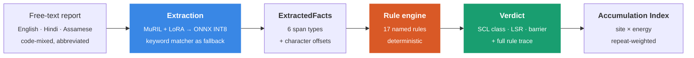

<div align="center">

# प्रहरी · prahari

### Most safety systems rank what happened. This one ranks what almost did.

An **offline, neuro-symbolic SIF precursor detection engine** for oil &amp; gas
safety reports — built for Smart India Hackathon 2026, problem statement
**PS 26165 (Oil India Limited)**.

[](#the-offline-guarantee)
[](#evaluation)
[](#evaluation)
[](#quickstart)
[](#the-control-room-ui)
[](#every-verdict-is-a-receipt)

[Why it exists](#the-problem-severity--potential) ·
[How it works](#how-it-works) ·
[Quickstart](#quickstart) ·
[Evaluation](#evaluation) ·
[Honest status](#honest-status)

</div>

---

## The problem: severity ≠ potential

A **SIF** is a Serious Injury or Fatality. The safety literature's central,
uncomfortable finding is that fatalities do **not** grow out of the pile of
minor injuries beneath them. They come from a different population entirely —
**high-energy work where a barrier was missing** — and most of the time that
population produces *no injury at all*, so it never reaches the top of anyone's
dashboard.

Every incident system in the industry ranks reports by **what happened**.
prahari ranks them by **what could have happened**.

<table>
<tr>
<th width="50%">Report A — the one everyone tracks</th>
<th width="50%">Report B — the one that matters</th>
</tr>
<tr>
<td>

> *"Sri R. Das (fitter) was cutting GI sheet at the workshop, Duliajan. Hand
> gloves were not worn. The blade slipped and he sustained a cut on the left
> index finger. First aid was given and he resumed duty."*

**A real injury.** Blood, a first-aid entry, a line in the monthly report.

`Low severity` — the energy involved could never have killed him.

</td>
<td>

> *"Sri B. Gogoi (fitter) was attending the belt of the pumping unit at Well
> No. 214, Moran. The machine guard was missing from the drive and the unit was
> not isolated at the panel. The belt started on auto while he was still inside
> the guard area. **There was no injury to any personnel.**"*

**Nothing happened.** No injury, no lost time, closed the same day almost
anywhere in the world.

`Potential SIF` — mechanical energy far past the high-energy threshold, the
one direct control absent, IOGP **Energy Isolation** breached.

</td>
</tr>
</table>

A severity model scores Report B at zero. That is not a tuning problem — it is
the model answering a different question. prahari asks: *was there enough
energy to kill someone, and was the barrier that stops it actually there?*

---

## Every verdict is a receipt

The hard part of safety AI is not accuracy. It is that an HSE manager has to
**defend the call to a union rep, a regulator, and the man it concerns** — and
"the model gave it 0.87" is not a defence.

So prahari is **neuro-symbolic**, and the split is absolute:

> **The model never decides.** It extracts spans of text — an energy source, a
> magnitude cue, a control mention, a negation. A **deterministic rule engine**
> reads those facts and makes the call. Every verdict names the rules that
> fired and the exact character ranges that triggered them.

```
Verdict:  POTENTIAL_SIF                          confidence 0.91
Rules:    R-ENERGY-01  mechanical energy identified      → "belt of the pumping unit"
          R-HE-02      high-energy cue, CATEGORICAL      → "pumping unit"
          R-CTRL-01    direct control ABSENT             → "machine guard was missing"
          R-CTRL-03    isolation NOT_FOLLOWED            → "not isolated at the panel"
          R-CLASS-01   EEI SCL decision table (T,T,F,F)  → PSIF
          R-LSR-01     primary rule: Energy Isolation
```

Swap the extractor — keyword matcher, MuRIL, anything — and the *justification
does not change shape*. A test enforces that the engine cannot tell which
extractor produced its facts.

---

## How it works



The boundary between **C** and **D** is the design principle. Facts cross it;
opinions do not. Everything left of it is replaceable; everything right of it
is auditable.

---

## Quickstart

**Prerequisites:** Python 3.11 and Node 18+. Docker optional.

```bash
git clone https://github.com/adityacs50-lab/Antardrishti.git
cd Antardrishti

make setup     # the ONLY step that needs a network — installs deps, fetches models
make verify    # proves the offline claim end to end. Must print PASSED.
make demo      # build + migrate + seed 700 reports + launch + open browser
```

Then **turn the network off** and everything still works. That is the point.

| Command | What it does |
|---|---|
| `make demo` | One command: build, seed, launch, open `localhost:5173` |
| `make verify` | Static ban-list scan → model checksums → boot with egress black-holed → assert a real verdict |
| `make reset` | Clean, seeded, known-good state in under 10 seconds |
| `make test` | 335 backend tests |
| `make doctor` | Preflight: interpreter, deps, ports, DB writability |

<details>
<summary><b>Running the pieces by hand</b></summary>

```bash
# Backend
cd backend
pip install -e ".[dev]"
python -m alembic upgrade head
python -m prahari.cli seed --limit 700
uvicorn prahari.main:app --reload        # http://localhost:8000/docs

# Frontend
cd web
npm install
npm run dev                              # http://localhost:5173

# Regenerate the labelled corpus (deterministic)
python -m prahari.data.generator --n 3000 --seed 42
```

</details>

<details>
<summary><b>If SQLite refuses to open the database</b></summary>

Network-synced folders (OneDrive-backed Desktop, network shares, some VM
mounts) cannot host a SQLite file — you will see `disk I/O error` regardless of
journal mode. prahari probes writability at startup with a real
create/insert/commit and relocates the database to the system temp directory,
logging a warning. Nothing to configure; just know why the path in the banner
may not be the one in the repo.

</details>

---

## The safety science, cited

`backend/prahari/domain/` is **pure data and types — it decides nothing.**
Every definition carries a citation, and anything prahari invented is tagged
`PRAHARI_CHOICE` so it is visibly distinguishable from published literature.

| Concept | Source |
|---|---|
| **Energy Wheel** — 10 hazardous-energy categories | EEI *Safety Classification &amp; Learning* model |
| **1,500 J high-energy threshold** + 18 observable cues | EEI *High-Energy Control Assessment* |
| **Direct control** — the verbatim three-part test | EEI HECA; Hallowell et al., *Prof. Safety J.* 2023 |
| **SCL seven-class taxonomy** — HSIF / LSIF / PSIF / Capacity / Exposure / Success / Low-severity | EEI SCL |
| **Nine Life-Saving Rules**, verbatim "I" statements | IOGP Report 459 |
| Indian upstream &amp; pipeline vocabulary | OISD standards (7 cited) |

Two details worth defending out loud:

- **The literature contradicts itself on units.** The published cue list quotes
  *500 ft-lb* (≈678 J) while the definition says *1,500 J*. We reproduce both
  and say which we use, rather than quietly picking one.
- **`PRESENT_UNVERIFIED` counts as non-protective.** EEI's limb (b) requires a
  control be "installed, **verified**, and used properly." A control someone
  believes is there is not a control. This cost us accuracy and is correct.

[`docs/DOMAIN.md`](./docs/DOMAIN.md) explains all 672 lines of it in plain
English, so it can be defended to a safety professional without a laptop.

---

## The labelled corpus

3,000 reports written the way Indian oilfield crews actually write them —
terse, abbreviation-heavy (`PTW`, `LOTO`, `WAH`, `H2S`, `BOP`, `GGS`),
typo-ridden, and code-mixed across **English, romanised Hindi, Devanagari,
romanised Assamese and Assamese script**, across real OIL locations
(Moran, Baghjan, Duliajan, Kusijan…).

**Reports are composed, never read back.** The generator picks a target SCL
class, builds a scenario spec that *yields exactly that class through the
published decision table*, and only then renders text — with gold character
spans that survive every noise injection. The labels are a property of the
spec, so they cannot be wrong the way hand-annotation is wrong.

Roughly **78% of records are deliberately adversarial**:

| Family | What it is | Why it is there |
|---|---|---|
| `high_potential_no_outcome` | Fatal potential, nobody scratched | A severity model scores these ~0. They are the entire thesis. |
| `visible_injury_low_potential` | Real injury, no fatal potential | A severity model over-ranks these. Exactly backwards. |
| `underdetermined` | Two vague lines | The correct answer is *"insufficient information."* Labels are null. |
| `controlled_high_energy` | High energy, barrier held | Must **not** flag, or the system cries wolf and gets switched off. |

---

## The Precursor Accumulation Index

The distinctive piece, and the third screen of the demo.

It scores each **site × energy source** and rises when *the same barrier
failure repeats at the same place* — because that repetition, not any single
report, is the pattern that precedes an actual event.

- Only precursors and real events contribute; controlled work adds nothing
- Every contributor is exponentially time-decayed (**45-day half-life**)
- Reports group by **barrier signature** = `(control, control_status)`
- Each signature's decayed count is raised to an exponent **> 1**, so repeats
  escalate super-linearly
- The strongest signature dominates; unrelated failures are discounted

> **Four failures of one barrier must outscore four failures of four
> barriers.** Linear counting ties them, which inverts the whole claim — we
> shipped that bug, then caught it by writing the assertion down as
> `test_repetition_outscores_variety`.

Every score returns its contributing report IDs and decayed weights, so an
auditor can recompute it by hand.

---

## The API

FastAPI + SQLite. No auth (demo prototype). **No network calls anywhere** —
one test parses every runtime module and fails the build if a network-capable
import appears; another exercises every endpoint with `socket.socket`
monkeypatched to raise.

| Endpoint | What it does |
|---|---|
| `POST /api/reports` | Ingest one report → extraction → engine → verdict |
| `POST /api/reports/bulk` | JSONL or CSV upload |
| `GET /api/reports` | Paginated; filter by class, LSR, site, energy, dates, confidence |
| `GET /api/reports/{id}` | Full detail with evidence spans for highlighting |
| `GET /api/triage` | SIF potential only, ranked by triage rank then recency |
| `GET /api/analytics/density` | Precursor density per site × activity |
| `GET /api/analytics/lsr` | Distribution across the nine Life-Saving Rules |
| `GET /api/analytics/barriers` | Which control fails most, where, trending |
| `GET /api/analytics/accumulation` | **Precursor Accumulation Index** |
| `PATCH /api/reports/{id}/review` | Human confirm/override |

**Human-in-the-loop is append-only.** A review writes a *new row*; the verdict
is never edited or deleted. An auditor can always see what the system said
before a human touched it — and the gap between the two is the training signal
for the next model.

---

## The control-room UI

`web/` — React + Vite + TypeScript, Tailwind, Recharts, shadcn-style
primitives. Dark industrial palette, **validated with a CVD/contrast validator
rather than eyeballed**.

| View | What it proves |
|---|---|
| **Triage Queue** | The ranking is by potential, not consequence — plus a *Live Analysis* panel that runs pasted text through the real API |
| **Report Detail** | Evidence spans highlighted inline beside the rule trace. This screen is the whole pitch: the system is auditable, not a black box. |
| **Precursor Map** | Density heatmap + the Accumulation Index, with an alert banner |
| **Life-Saving Rules** | Distribution across all nine, with per-rule barrier drill-down |

Three things it deliberately does **not** do: run rule logic in the browser,
fall back to mock data when the API is down (it shows a loud offline state
instead), or fetch anything from the network — no CDN, no web fonts, no
analytics.

---

## The ML extraction layer

MuRIL (`google/muril-base-cased`) fine-tuned with **LoRA** (r=16, α=32, attention
projections) for **token classification** — tagging `ENERGY_SOURCE`,
`MAGNITUDE_CUE`, `CONTROL_MENTION`, `CONTROL_NEGATION`, `ACTIVITY`, `LOCATION`.
Merged, quantised to INT8, exported to ONNX, run on CPU.

```bash
pip install -e ".[train]"
python -m prahari.ml.training.prepare_data   # corpus → BIO dataset
python -m prahari.ml.training.train_lora     # ~2 GPU-hours on a Colab T4
python -m prahari.ml.training.evaluate       # metrics + false-negative dossier
python -m prahari.ml.training.export_onnx    # → models/prahari.onnx (INT8)
```

Three decisions worth knowing:

- **Labels come from the generator, not the keyword extractor.** Training on
  the keyword extractor's own matches would produce a model that can only ever
  imitate it.
- **The threshold favours recall (0.35, not 0.5)**, and the best checkpoint is
  chosen on recall, not F1. *A false positive costs one HSE review; a false
  negative costs a life.* `tests/ml/test_recall_floor.py` fails below 0.90.
- **It fails closed.** Missing model, corrupt model, any inference error → a
  logged warning and an automatic revert to the keyword extractor. The demo
  cannot hard-fail.

---

## Evaluation

Held-out split, **keyword extraction path**, engine unchanged:

| Split | Accuracy |
|---|---|
| **Test** (450 reports) | **83.3%** — 375/450 |
| **Validation** (450 reports) | **84.2%** — 379/450 |

Per class, where the failures actually are:

| SCL class | Accuracy | |
|---|---:|---|
| HSIF | 100.0% | `██████████` |
| Insufficient information | 96.4% | `█████████▋` |
| Exposure | 95.6% | `█████████▌` |
| LSIF | 92.0% | `█████████▏` |
| Success | 85.1% | `████████▌` |
| Low severity | 79.0% | `███████▉` |
| PSIF | 75.0% | `███████▌` |
| Capacity | 55.6% | `█████▌` |

The `capacity` row is the honest weak spot: it requires recognising that a
control *held under load*, which is the subtlest thing in the taxonomy and the
rarest in the corpus.

```
335 passed, 3 skipped in 87.80s
```

The 3 skips are ONNX tests that unlock once a model is trained. The neural
inference path is exercised in CI against a **stub ONNX graph**, so it is tested
today rather than untested until someone opens Colab.

---

## The offline guarantee

The constraint is architectural, not aspirational. `scripts/verify_offline.sh`
runs five sections:

1. **Static ban-list** — greps the entire runtime for `openai`, `anthropic`,
   `requests`, and any `http(s)://` literal that is not localhost. Fails loudly.
2. **Model artefacts** — every file in `./models` present, with checksums.
3. **Preflight** — interpreter, dependencies, ports, DB writability.
4. **Live boot** — starts the full stack with outbound traffic pointed at a
   black hole, POSTs a real report, asserts the correct verdict.
5. **Teardown** — clean exit, no orphan processes.

The API prints a **startup banner** and the UI shows a **badge** stating which
extraction path is live (ONNX or keyword fallback), the engine version, and the
report count — so nobody in the room has to take a claim on trust.

[`DEMO.md`](./DEMO.md) is a 90-second runbook: exact click path, three reports
in order, and the sentence to say at each step. Its every claim is pinned by
`backend/tests/test_demo_contract.py`, so a lexicon change that would break the
runbook fails the build instead of the demo.

---

## Repository layout

```
prahari/
├── CLAUDE.md                    # non-negotiable architecture rules
├── DEMO.md                      # 90-second runbook, claims pinned by tests
├── Makefile                     # setup · verify · demo · reset · doctor
├── docs/DOMAIN.md               # every safety definition, cited, in plain English
├── scripts/
│   ├── verify_offline.sh        # the offline proof
│   ├── reset_demo.sh            # known-good state in <10s
│   └── launch_demo.sh
├── backend/prahari/
│   ├── domain/                  # safety science. Pure data. Decides nothing.
│   ├── data/                    # corpus generator with gold spans
│   ├── ml/                      # extraction only — NEVER a verdict
│   │   └── training/            # prepare · LoRA · evaluate · ONNX export
│   ├── rules/engine.py          # 17 named rules — the only thing that decides
│   ├── api/                     # 12 endpoints
│   ├── db/  core/  cli.py
│   └── tests/                   # 335 tests
└── web/src/                     # React control-room UI, four views
```

---

## Honest status

Built and measured:

| | |
|---|---|
| Backend | 9,984 lines |
| Tests | 2,040 lines · **335 passing**, 3 skipped |
| Frontend | 2,769 lines across 28 files |
| Docs &amp; scripts | 1,849 lines |
| End-to-end accuracy | 83.3% test / 84.2% validation |

Not yet done, stated plainly because a system that hides its gaps cannot be
trusted about anything else:

- **LoRA training has never been run** — no GPU. Every number above comes from
  the keyword extraction path. The ONNX runtime is tested against a stub graph.
- **`docker compose up` has never been executed.** The compose file and
  Dockerfiles exist and are wired; they are unverified.
- **No real OIL report has ever passed through this.** The corpus is synthetic
  by construction. Accuracy against field text is unknown, and the vocabulary
  is the first thing that will need widening.
- Production hardening — auth, rate limiting, upload caps, structured logging,
  pagination on two analytics endpoints, frontend tests, CI — is not present.
  This is a demo prototype, and `CLAUDE.md` says so.

---

## Sources

Edison Electric Institute, *Safety Classification &amp; Learning Model* ·
EEI *High-Energy Control Assessment* ·
Hallowell, Quashne, Salas, Jones &amp; MacLean, *Professional Safety Journal*, 2023 ·
INGAA *High-Energy Hazard Control*, 2024 ·
IOGP Report 459, *Life-Saving Rules* ·
Oil Industry Safety Directorate (OISD) E&amp;P standards.

<div align="center">
<sub>Built for Smart India Hackathon 2026 · PS 26165 · Oil India Limited</sub>
</div>
