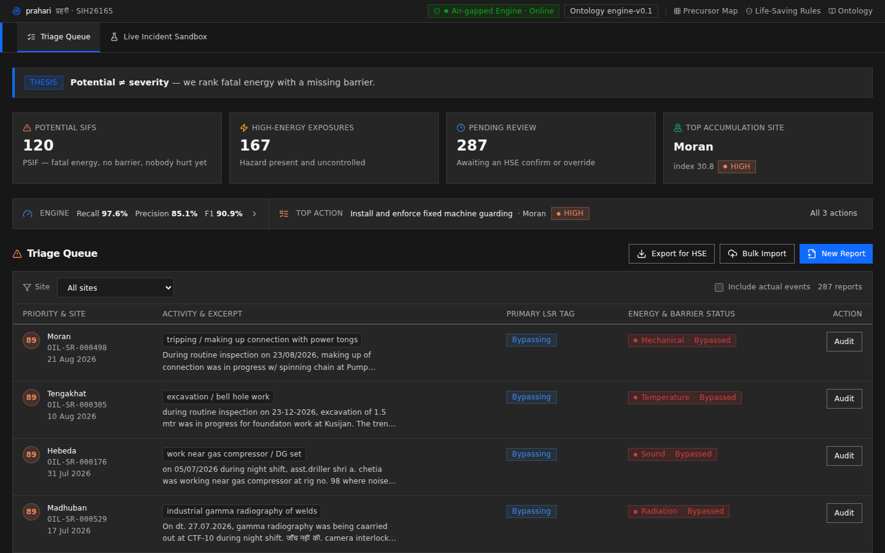
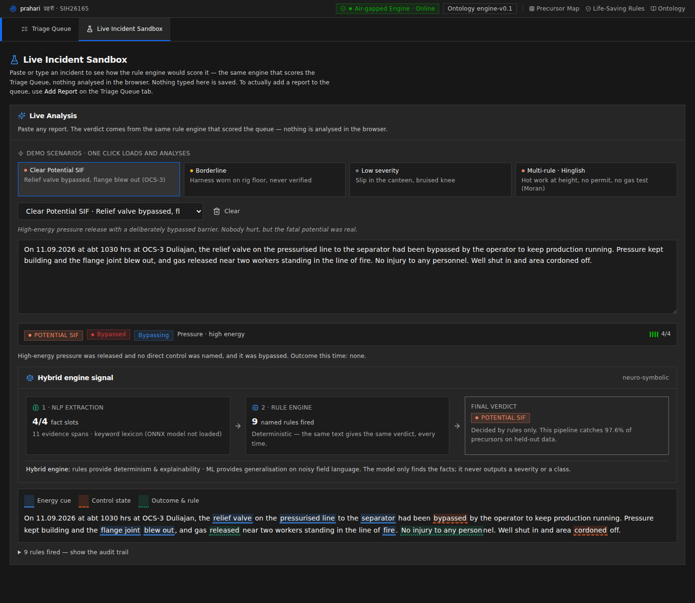
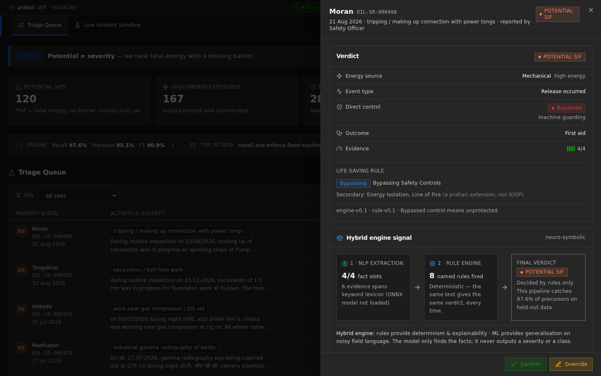
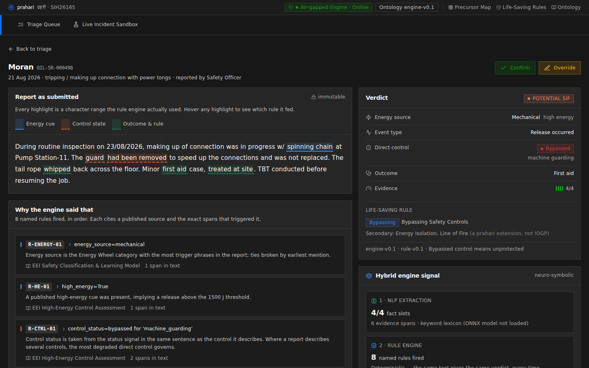
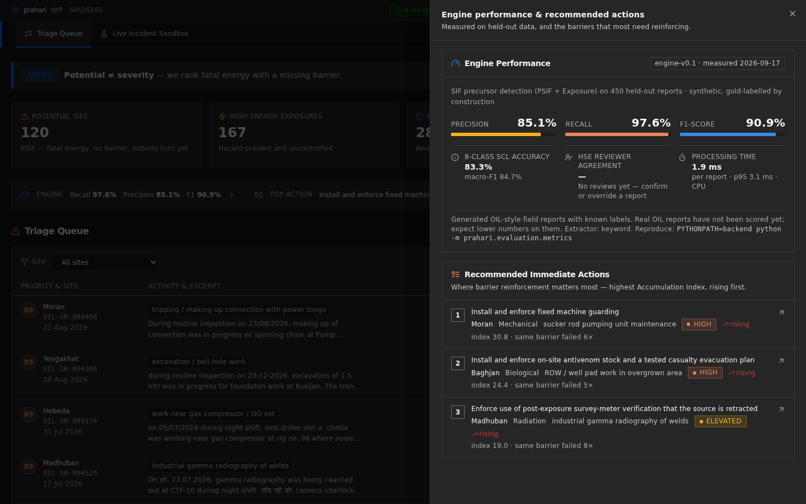
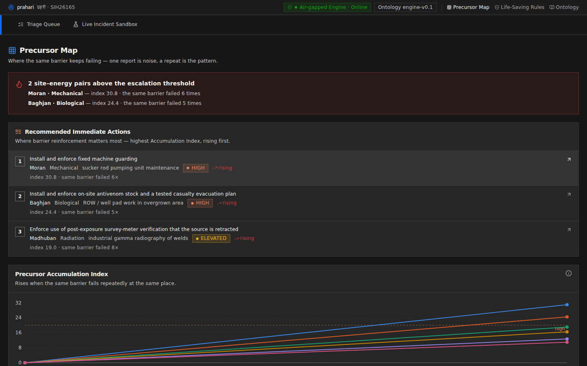
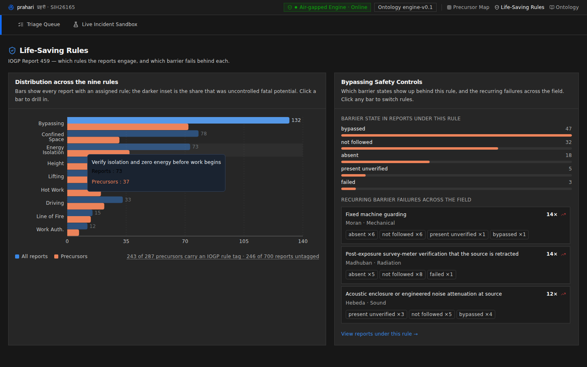
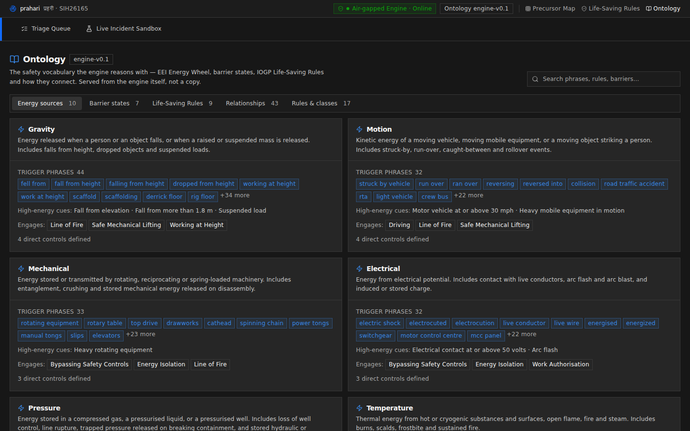
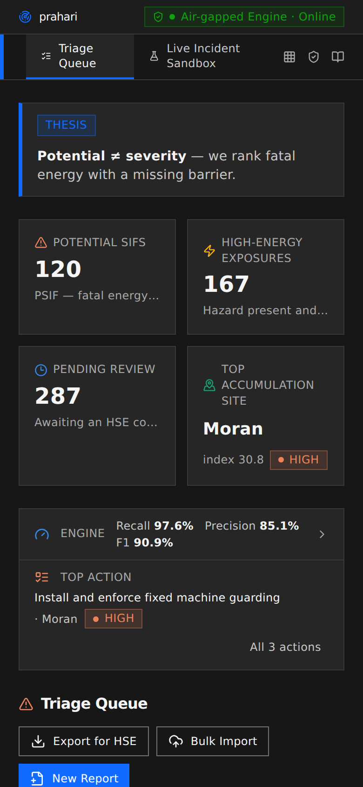
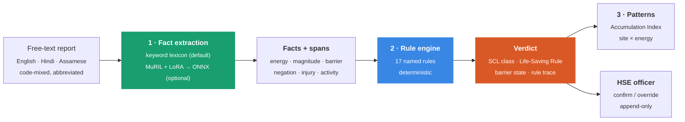

<div align="center">

# प्रहरी · prahari

### Most safety systems rank what happened. prahari ranks what almost did.

**prahari** (Hindi for *sentinel*) reads oil & gas safety reports and flags the ones that could have killed someone, even when nobody was hurt.

It runs **100% offline**, and every verdict comes with the exact rules and words that produced it.

Built by **Team Antardrishti** for **Smart India Hackathon 2026**, problem statement **SIH26165**: *AI/NLP engine to detect SIF precursors*, set by **Oil India Limited**.

[](#-the-offline-guarantee)
[](#-results)
[](#-results)
[](#-results)
[](#-how-it-works)
[](#-quickstart)

[What it is](#-what-prahari-is-in-60-seconds) ·
[The problem](#-the-problem-severity--potential) ·
[Features](#-what-you-can-do-with-it) ·
[How it works](#-how-it-works) ·
[Results](#-results) ·
[Quickstart](#-quickstart) ·
[Limitations](#-honest-status--limitations)



</div>

---

## 🧭 What prahari is, in 60 seconds

| | |
|---|---|
| **What it does** | Takes free-text safety reports (unsafe acts, unsafe conditions, near misses, incidents) and decides which ones are **SIF precursors**: situations with enough energy to cause a **S**erious **I**njury or **F**atality, where the barrier that should stop it was missing, failed or bypassed. |
| **Who it's for** | HSE (Health, Safety & Environment) officers and safety managers at oil & gas operators who receive hundreds of reports and must decide which few need action today. |
| **What makes it different** | It ranks by **potential**, not by what happened. A cut finger ranks low. A missing machine guard on a running pump ranks high, even if nobody was hurt. |
| **Why you can trust it** | An NLP layer only **finds facts** in the text. A **deterministic rule engine** makes every decision. Each verdict lists the named rules that fired and highlights the exact words they used. There is no black-box score. |
| **Where it runs** | Entirely on a laptop or a site server with **no internet**: no cloud APIs, no LLM calls, no CDN. It works in field conditions and air-gapped control rooms. |
| **Languages** | English, romanised Hindi, Devanagari, romanised Assamese and Assamese script, including code-mixed field writing such as *"Hot work permit nahi liya gaya tha"*. |

---

## 🎯 The problem: severity ≠ potential

The central, uncomfortable finding of modern safety science is that **fatalities do not grow out of the pile of minor injuries**.
- They come from a different population: **high-energy work where a barrier was missing**.
- Most of the time, that population produces **no injury at all**, so it never reaches the top of anyone's dashboard.

Almost every incident system ranks reports by **what happened**. prahari ranks them by **what could have happened**.

<table>
<tr>
<th width="50%">Report A: the one everyone tracks</th>
<th width="50%">Report B: the one that matters</th>
</tr>
<tr>
<td>

> *"Sri R. Das (fitter) was cutting GI sheet at the workshop, Duliajan. Hand gloves were not worn. The blade slipped and he sustained a cut on the left index finger. First aid was given and he resumed duty."*

**A real injury:** blood, a first-aid entry, a line in the monthly report.

prahari says **`Low severity`**. The energy involved could never have killed him.

</td>
<td>

> *"Sri B. Gogoi (fitter) was attending the belt of the pumping unit at Well No. 214, Moran. The machine guard was missing from the drive and the unit was not isolated at the panel. The belt started on auto while he was still inside the guard area. **There was no injury to any personnel.**"*

**Nothing happened.** Almost anywhere, this report would be closed the same day.

prahari says **`Potential SIF`**. High mechanical energy was released, the direct control (machine guarding) was **absent**, and the IOGP Life-Saving Rule **Energy Isolation** was breached.

</td>
</tr>
</table>

A severity-based model scores Report B near zero. That isn't a tuning problem; it is answering a different question.

prahari asks: ***was there enough energy to kill someone, and was the barrier that stops it actually there?***

---

## ✨ What you can do with it

| Screen | What it's for |
|---|---|
| **Triage Queue** | Every SIF precursor, ranked by fatal potential. Filter by site or Life-Saving Rule, open any report in an **Audit** drawer, and **Confirm** or **Override** the verdict. A slim insights bar shows the engine's measured accuracy and the single most urgent action. |
| **Live Incident Sandbox** | Paste or type any report and get a verdict as you type, with nothing saved. It has four one-click demo scenarios: a clear Potential SIF, a borderline case, a low-severity case and a multi-rule Hinglish report. |
| **Report detail / Audit** | The report with every piece of evidence highlighted, the ordered list of named rules that fired, the verdict, and a **Hybrid engine signal** panel showing what the NLP layer extracted and what the rules decided. |
| **Precursor Map** | A site × activity heatmap plus the **Precursor Accumulation Index**, which rises when *the same barrier fails repeatedly at the same place*. It also lists **Recommended Immediate Actions**, the top 3 barriers to reinforce. |
| **Life-Saving Rules** | How reports spread across the nine IOGP Life-Saving Rules, with a per-rule drill-down into which barrier states show up and a link to those reports. |
| **Ontology** | A searchable view of everything the engine reasons with: the 10 energy sources, 7 barrier states, 43 barriers, the 9 Life-Saving Rules, how they connect, and all 17 named rules. It is served from the engine itself, not a copy. |
| **New Report / Bulk Import** | Add one report (text, PDF or .txt) or import a whole CSV/JSONL export. Every row runs through the same engine and is saved. |
| **Export for HSE** | Download the currently filtered queue as a CSV (opens in Excel, Indian scripts intact) or as a print-ready PDF summary. |

<details open>
<summary><b>Screenshots</b></summary>

| | |
|---|---|
| **Live Incident Sandbox**, one-click scenario, hybrid signal, highlighted evidence<br> | **Audit drawer**, verdict + hybrid signal + Confirm / Override<br> |
| **Report detail**, every highlight is a span a rule actually used<br> | **Engine performance & recommended actions**<br> |
| **Precursor Map**, escalation alert + actions + accumulation index<br> | **Life-Saving Rules** distribution and barrier drill-down<br> |
| **Ontology explorer**<br> | **Works on a phone**<br> |

</details>

---

## ⚙️ How it works

prahari is **neuro-symbolic**, and the split between the two halves is absolute:

> **The model never decides.** The NLP layer only extracts facts: an energy source, a magnitude, a barrier mention, a negation, each with exact character positions.
> A **deterministic rule engine** reads those facts and makes the call. Same text in, same verdict out, every time.



The boundary between **facts** and the **rule engine** is the design principle: facts cross it, opinions do not. Everything to its left can be replaced (keyword matcher, MuRIL, anything else). Everything to its right is auditable, and a test enforces that the engine cannot tell which extractor produced its facts.

### Every verdict is a receipt

This is the real rule trace for Report B above, as the app shows it:

```text
Verdict: POTENTIAL SIF    Life-Saving Rule: Energy Isolation    Evidence: 4/4 fact slots

R-ENERGY-01  energy_source = mechanical              ← "pumping unit", "machine guard"
R-HE-01      high_energy = true                      ← "pumping unit"
R-CTRL-01    control_status = ABSENT (machine guard) ← "machine guard" … "was missing", "not isolated"
R-EFFECT-01  direct_control_effective = false        ← only a VERIFIED direct control protects
R-INJ-01     injury_outcome = none                   ← "no injury to any personnel"
R-EVENT-01   high_energy_incident = true             ← "started on auto"
R-CLASS-01   classification = PSIF                   ← EEI SCL decision table
R-LSR-01     primary Life-Saving Rule = Energy Isolation ← "not isolated"
```

An HSE manager has to defend a call to a regulator, a union representative and the worker it concerns, and *"the model gave it 0.87"* is not a defence. This trace is.

> **Note:** prahari deliberately has **no ML confidence score**. What the UI shows is *evidence completeness*: how many of the four required facts (energy, magnitude, barrier state, outcome) were found in the text.

### The decision, in one table

prahari implements the Edison Electric Institute **Safety Classification & Learning (SCL)** model:

| Class | High energy? | Energy released? | Direct control worked? | Serious injury? | Meaning |
|---|:-:|:-:|:-:|:-:|---|
| **HSIF** | ✔ | ✔ | ✘ | ✔ | Serious injury/fatality from high energy |
| **LSIF** | ✘ | – | – | ✔ | Serious outcome, not from high energy |
| **PSIF** ⚠ | ✔ | ✔ | ✘ | ✘ | **Potential SIF**: energy got loose, nothing stopped it, nobody hurt *this time* |
| **Exposure** ⚠ | ✔ | ✘ | ✘ | ✘ | A high-energy hazard sat there uncontrolled |
| **Capacity** | ✔ | ✔ | ✔ | ✘ | Energy released and the barrier held |
| **Success** | ✔ | ✘ | ✔ | ✘ | Hazard present, verified barrier in place |
| **Low severity** | ✘ | – | – | ✘ | No fatal potential, whatever the injury |
| **Insufficient info** | | | | | *prahari extension*: too vague to judge honestly |

⚠ = **SIF precursor**. These are what the Triage Queue surfaces.

---

## 📊 Results

Measured by a script, not typed in. Anyone can reproduce these numbers with:

```bash
PYTHONPATH=backend python -m prahari.evaluation.metrics
```

The Engine Performance panel in the app reads the same output file.

**SIF precursor detection** (is this report a PSIF or an Exposure?), on **450 held-out reports**:

| Metric | Value | What it means |
|---|---:|---|
| **Recall** | **97.6%** | Of real precursors, 160 of 164 were flagged. The engine is tuned for this number, because a miss can cost a life. |
| **Precision** | **85.1%** | Of flagged reports, 160 of 188 were real precursors. A false alarm costs a reviewer a few minutes. |
| **F1-score** | **90.9%** | Balance of the two |
| **8-class SCL accuracy** | **83.3%** | Exact class out of all eight (macro-F1 84.7%) |
| **Processing time** | **~1.9 ms** / report | Plain CPU, no GPU |
| Full 3,000-report corpus | P 87.2% · R 96.5% · F1 91.6% | Same pipeline |

<details>
<summary><b>Per-class recall (held-out test set)</b></summary>

| SCL class | Recall | Reports | |
|---|---:|---:|---|
| HSIF | 100.0% | 32 | `██████████` |
| Insufficient information | 96.4% | 56 | `█████████▋` |
| Exposure | 95.6% | 68 | `█████████▌` |
| LSIF | 92.0% | 25 | `█████████▏` |
| Success | 85.1% | 47 | `████████▌` |
| Low severity | 79.0% | 81 | `███████▉` |
| PSIF | 75.0% | 96 | `███████▌` |
| Capacity | 55.6% | 45 | `█████▌` |

**Why is PSIF only 75% when precursor recall is 97.6%?** Most PSIF misses are classified as *Exposure*, the other precursor class. They still land in the Triage Queue; the engine just wasn't sure energy was *released*.

**Capacity** is the honest weak spot. It requires recognising that a barrier *held under load*, the subtlest distinction in the taxonomy.

</details>

**HSE reviewer agreement** is shown live in the app: the share of reviewed reports where an officer confirmed the engine's verdict rather than overriding it. It is computed from real confirm/override decisions, never pre-set.

> **Important:** these numbers come from a **synthetic corpus** written in Oil India field style, with gold labels. No real OIL report has been scored yet, so expect lower numbers on real field text. See [Limitations](#-honest-status--limitations).

---

## 🚀 Quickstart

**You need:** Python **3.11+** and Node **18+**. Internet is needed **only to install** dependencies; after that, disconnect.

### Windows (one click)

```powershell
git clone https://github.com/adityacs50-lab/Antardrishti.git
cd Antardrishti
.\run_prahari_demo.bat
```

The script:
- installs the backend and seeds ~700 demo reports (into `%LOCALAPPDATA%\prahari\`, which avoids OneDrive SQLite issues)
- builds the UI
- opens **http://localhost:8000**

Re-running it keeps your data and your reviews. Close the window to stop.

### Linux / macOS

```bash
git clone https://github.com/adityacs50-lab/Antardrishti.git
cd Antardrishti

make setup     # the ONLY step that needs a network: installs Python + npm deps
make verify    # proves the offline claim end to end; must print PASSED
make demo      # build, seed 700 reports, launch, open http://localhost:5173
```

Then **turn the network off**. Everything still works; that is the point.

| Command | What it does |
|---|---|
| `make demo` | Build, seed, launch API (`:8000`) and UI (`:5173`) |
| `make verify` | Offline proof: no network imports, no external URLs, model checksums, full boot with outbound traffic black-holed |
| `make reset` | Back to a clean, seeded, known-good state in seconds |
| `make test` | Backend test suite |
| `make lint` | TypeScript type-check of the UI |
| `make doctor` | Preflight: Python, dependencies, ports, database writability |

<details>
<summary><b>Running the pieces by hand</b></summary>

```bash
# Backend (from the repo root)
pip install -e ".[dev]"
PYTHONPATH=backend python -m prahari.cli seed --limit 700
PYTHONPATH=backend uvicorn prahari.main:app --reload     # API docs: http://localhost:8000/docs

# Frontend
cd web
npm install
npm run dev                                               # http://localhost:5173 (proxies /api to :8000)

# Or build the UI once and let the API serve it on :8000
npm run build

# Tests
PYTHONPATH=backend python -m pytest backend/tests -q

# Regenerate the labelled corpus (deterministic)
PYTHONPATH=backend python -m prahari.data.generator --n 3000 --seed 42
```

</details>

<details>
<summary><b>Docker</b></summary>

```bash
docker compose up --build     # API on :8000, UI on :5173
```

The compose file and Dockerfiles are wired for fully offline runtime, but **they have not been run end to end yet**. Prefer the Windows script or `make demo` for a demo.

</details>

<details>
<summary><b>"disk I/O error" from SQLite?</b></summary>

Network-synced folders (OneDrive-backed Desktop, network shares, some VM mounts) cannot host a SQLite file. prahari tests writability at startup and moves the database to the system temp directory, logging a warning. On Windows the launcher avoids this by using `%LOCALAPPDATA%`.

</details>

### A 90-second tour

1. **Triage Queue:** the thesis strip, the insights bar and the ranked queue. Click **Audit** on the top row.
2. **Live Incident Sandbox:**
   - Click **Low severity**: a real injury, low potential.
   - Click **Clear Potential SIF**: nobody hurt, fatal potential. Point at the *Hybrid engine signal* and the highlights.
   - Click **Multi-rule · Hinglish**: code-mixed text, three Life-Saving Rules.
3. **Triage Queue → insights bar → All actions:** click the top recommendation. The queue filters to that site. Then **Export for HSE → PDF summary**.
4. **Ontology:** everything the engine reasons with, searchable.

The full spoken script is [`DEMO_SCRIPT_90s.md`](./DEMO_SCRIPT_90s.md), and the judge one-pager is [`JUDGES.md`](./JUDGES.md).

---

## 🔬 The safety science, cited

`backend/prahari/domain/` is **pure data. It decides nothing.** Every definition carries a citation, and anything prahari invented is tagged `PRAHARI_MODELLING` so nobody credits it to IOGP or EEI.

| Concept | Source |
|---|---|
| **Energy Wheel**: 10 hazardous-energy categories (gravity, motion, mechanical, electrical, pressure, temperature, chemical, biological, radiation, sound) | EEI *Safety Classification & Learning* model |
| **1,500 J high-energy threshold** + 18 observable high-energy cues | EEI *High-Energy Control Assessment* |
| **Direct control**: the three-part test (targets the energy · works when used properly · survives human error) | EEI HECA; Hallowell et al., *Professional Safety Journal*, 2023 |
| **SCL taxonomy** (7 classes) | EEI SCL |
| **Nine Life-Saving Rules**, with their official "I" statements | IOGP Report 459 |
| Indian upstream & pipeline vocabulary | OISD standards STD-174, STD-190, STD-216, STD-231, GDN-182, GDN-226, RP-238 |

Two choices worth defending out loud:

- **An unverified barrier is not a barrier.** EEI requires a control to be *"installed, **verified**, and used properly."* A harness someone *says* was worn is recorded as `PRESENT_UNVERIFIED` and counts as **unprotected**. This costs accuracy and is correct.
- **Absence of evidence is not a control.** If a high-energy hazard is described and no barrier is mentioned, prahari records `ABSENT`, never "probably fine". It produces false alarms, never false all-clears.

[`docs/DOMAIN.md`](./docs/DOMAIN.md) explains every definition in plain English.

---

## 🧪 The labelled corpus

There is no public, labelled dataset of Indian oilfield safety reports, so prahari ships one: **3,000 reports** written the way crews actually write them.
- **Style:** terse and abbreviation-heavy (`PTW`, `LOTO`, `WAH`, `H2S`, `BOP`, `GGS`), with realistic typos.
- **Languages:** code-mixed across five scripts and registers.
- **Locations:** real OIL sites (Moran, Baghjan, Duliajan, Kusijan…).

**Labels are composed, never guessed.** The generator:
1. picks a target SCL class;
2. builds a scenario that yields exactly that class through the published decision table;
3. only then renders text, with gold character spans that survive every typo and abbreviation.

About **78% of records are deliberately hard**:

| Family | What it is | Why it matters |
|---|---|---|
| `high_potential_no_outcome` | Fatal potential, nobody scratched | A severity model scores these ~0. They are the whole thesis. |
| `visible_injury_low_potential` | Real injury, no fatal potential | A severity model over-ranks these. |
| `underdetermined` | Two vague lines | The right answer is *"insufficient information"*. |
| `controlled_high_energy` | High energy, barrier held | Must **not** be flagged, or the system cries wolf and gets switched off. |

The split is 2,100 train / 450 validation / 450 test.

---

## 📈 The Precursor Accumulation Index

One report is noise. **The same barrier failing again at the same place is the pattern that precedes a fatality.**

The index scores each **site × energy source**:
- Only precursors and real events count; controlled work adds nothing.
- Each report fades with time (**45-day half-life**).
- Reports are grouped by **barrier signature**: *which barrier, in what state*.
- Repeats of the same signature grow **faster than linearly**, so four failures of one barrier outscore four failures of four different barriers. A test (`test_repetition_outscores_variety`) pins this.
- Bands: *watch → elevated → high → critical*, with a rising/falling trend.

Every score lists its contributing report IDs and weights, so an auditor can recompute it by hand. **Recommended Immediate Actions** are a plain, deterministic reading of this index: highest band, rising first, with the verb chosen by *how* the barrier failed (bypassed → audit override authorisations; absent → install and enforce; and so on).

---

## 🔌 The API

FastAPI + SQLite. Interactive docs at **`/docs`** once the API is running.

| Endpoint | Purpose |
|---|---|
| `GET /health` | Status, engine version, which extractor is live, report count |
| `POST /api/analyze` | Score text **without saving** (powers the Sandbox) |
| `POST /api/reports` | Save one report → extraction → rules → verdict |
| `POST /api/reports/bulk` | CSV / JSONL import |
| `POST /api/extract-text` | Pull text out of a PDF or .txt |
| `GET /api/reports` | List with filters: class, rule, site, energy, dates, evidence |
| `GET /api/reports/{id}` | Full detail, evidence spans and review history |
| `PATCH /api/reports/{id}/review` | HSE **confirm / override** (append-only) |
| `GET /api/triage` | Precursors only, ranked. Filter by site or Life-Saving Rule |
| `GET /api/meta` | Sites, activities, vocabularies, versions |
| `GET /api/analytics/density` | Precursor share per site × activity |
| `GET /api/analytics/lsr` | Distribution over the nine Life-Saving Rules |
| `GET /api/analytics/barriers` | Which barriers fail most, where, trending |
| `GET /api/analytics/accumulation` | **Precursor Accumulation Index** |
| `GET /api/ontology` | The full vocabulary the engine uses |
| `GET /api/engine-metrics` | Measured benchmark + live reviewer agreement |

**Reviews are append-only.** A confirm or override writes a *new* record; the engine's verdict is never edited or deleted. An auditor can always see what the system said before a human touched it.

---

## 🧠 The ML extraction layer (optional)

The default extractor is a deterministic keyword lexicon built for Indian field vocabulary, and every number above comes from it.

prahari also ships a complete pipeline for a neural extractor. It fine-tunes **MuRIL** (`google/muril-base-cased`) with **LoRA** to tag six span types, then merges, quantises to INT8 and exports to **ONNX** for CPU inference.

```bash
pip install -e ".[train]"
python -m prahari.ml.training.prepare_data   # corpus → token-tagging dataset
python -m prahari.ml.training.train_lora     # ~2 GPU-hours on a free Colab T4
python -m prahari.ml.training.evaluate       # metrics + list of every missed precursor
python -m prahari.ml.training.export_onnx    # → models/prahari.onnx
```

No GPU? Run [`notebooks/train_on_colab.ipynb`](./notebooks/train_on_colab.ipynb).&nbsp;[](https://colab.research.google.com/github/adityacs50-lab/Antardrishti/blob/main/notebooks/train_on_colab.ipynb)

Design choices:
- **Recall first.** The decision threshold is 0.35, not 0.5, and a test fails the build below 90% entity recall. *A false positive costs one review; a false negative can cost a life.*
- **It can only find facts.** Even with the model loaded, the rules still decide. The model's job is to catch unusual phrasing the lexicon misses.
- **It fails safe.** A missing or broken model means a logged warning and an automatic fallback to the lexicon. The app header always says which path is live.

---

## 🔒 The offline guarantee

The offline rule is enforced in code and tests:

- **Tests** parse every runtime module and fail if anything network-capable is imported, and exercise every endpoint with network sockets disabled.
- **`scripts/verify_offline.sh`** (`make verify`) checks four things:
  - **A.** No runtime module imports anything network-capable.
  - **B.** No runtime file or built UI bundle contains an external URL.
  - **C.** Every model file matches its recorded checksum.
  - **D.** The whole stack boots, seeds and classifies a report correctly **with outbound traffic pointed at a black hole**.
- **The UI** uses system fonts, no CDN and no analytics. When the backend is unreachable it shows a loud *"Backend unreachable"* state. It **never** shows sample or fake verdicts.
- The API prints a startup banner, and the header shows an **Air-gapped Engine** badge with the live extractor and ontology version.

---

## 🗂 Repository layout

```text
.
├── README.md · JUDGES.md · DEMO.md · DEMO_SCRIPT_90s.md · DESIGN.md
├── CLAUDE.md                    # non-negotiable architecture rules
├── Makefile                     # setup · verify · demo · reset · test · doctor
├── run_prahari_demo.bat         # Windows one-click launcher
├── docs/
│   ├── DOMAIN.md                # every safety definition, cited, in plain English
│   └── screenshots/
├── scripts/                     # verify_offline.sh · demo_windows.ps1 · launch/reset
├── data/
│   ├── synthetic_reports.jsonl  # the 3,000-report labelled corpus
│   └── demo_seed.db             # pre-scored demo database
├── backend/
│   ├── prahari/
│   │   ├── domain/              # safety science: pure data, decides nothing
│   │   ├── ml/                  # fact extraction only, never a verdict
│   │   │   └── training/        # MuRIL + LoRA → ONNX (build-time only)
│   │   ├── rules/engine.py      # the 17 named rules: the only thing that decides
│   │   ├── api/                 # FastAPI routes, analytics, ontology
│   │   ├── evaluation/          # reproducible benchmark → engine_metrics.json
│   │   ├── data/                # corpus generator with gold spans
│   │   └── db/ · core/ · cli.py
│   └── tests/                   # 361 tests
├── web/src/                     # React + TypeScript control-room UI
│   ├── views/                   # Triage · Sandbox · Report · Map · Rules · Ontology
│   ├── components/
│   └── data/demo-scenarios.json # the 4 sandbox scenarios (verified by backend tests)
├── api/index.py                 # Vercel entry point
├── notebooks/train_on_colab.ipynb
└── docker/ · docker-compose.yml
```

---

## ✅ Honest status & limitations

**Built and verified:**
- **Tests:** 361 backend tests pass. 13 more skip unless the optional ML packages (`onnx`, `onnxruntime`) and a trained model are installed.
- **UI checks:** type-check and production build are clean. An automated browser walk-through covers every screen at desktop, tablet and phone sizes, plus the main flows: add report, confirm/override, bulk import, filters, export and the sandbox scenarios.
- **Real-world transfer test:** the engine was run on **105,996 real US OSHA severe-injury reports**. That surfaced vocabulary gaps (e.g. *"hospitalized"*, *"fracturing"*), which were fixed in the injury lexicon without changing a single result on the OIL-style corpus.

**Not done yet, stated plainly:**
- **No real Oil India report has been scored.** The accuracy figures come from the synthetic corpus, and field text will need wider vocabulary.
- **The neural extractor has not been trained** (no GPU yet). Every number here is from the keyword path. The ONNX runtime path is tested against a stub model.
- **OSHA figure not re-measured.** The OSHA recall after the lexicon fix (44.1% → 77.1%) was measured on an earlier build and has not been re-run on this one.
- **`docker compose up` has not been run end to end.**
- **This is a prototype.** There is no authentication, user accounts or rate limiting, by design (see `CLAUDE.md`).

A system that hides its gaps can't be trusted about anything else.

---

## ❓ FAQ

<details>
<summary><b>Is an AI model deciding whether something is a SIF?</b></summary>

No. The NLP layer only finds facts in the text. Named, deterministic rules decide, and every verdict shows which rules fired and on which words.
</details>

<details>
<summary><b>Does it need the internet or a GPU?</b></summary>

No. Internet is needed only to install dependencies. Scoring a report takes about 2 ms on an ordinary CPU.
</details>

<details>
<summary><b>What if the HSE officer disagrees?</b></summary>

They click **Override**, pick the correct class and give a reason. The override is stored next to the engine's verdict, never over it, and the live *reviewer agreement* figure updates.
</details>

<details>
<summary><b>Can it read Hindi or Assamese?</b></summary>

Yes. The lexicon and corpus cover romanised Hindi, Devanagari, romanised Assamese and Assamese script, including sentences that mix them with English.
</details>

<details>
<summary><b>How do I load our own reports?</b></summary>

Use **Bulk Import** on the Triage Queue with a CSV or JSONL file. The required column is `text`; the optional ones are `site`, `date`, `activity` and `reporter_role`.
</details>

---

## 📚 Sources

- Edison Electric Institute, *Safety Classification & Learning (SCL) Model*
- EEI, *High-Energy Control Assessment (HECA)*
- Hallowell, Quashne, Salas, Jones & MacLean, *Professional Safety Journal*, 2023
- INGAA, *High-Energy Hazard Control*, 2024
- IOGP Report 459, *Life-Saving Rules*
- Oil Industry Safety Directorate (OISD), E&P standards

<div align="center">
<sub>प्रहरी · Built by Team Antardrishti for Smart India Hackathon 2026 · SIH26165 · Oil India Limited</sub>
</div>
